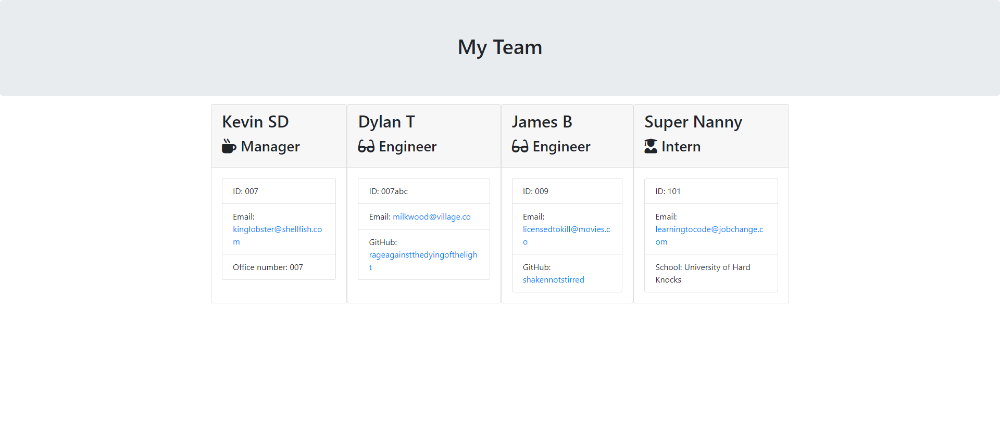

# testdriven
A code written to fulfil a Jest Suite and render html pages


## Description

This webpage demonstrates my ability to use some javascript logic with nodejs to dynamically generate html.

## Table of Contents

Included for your ease of use is a table of contents

- [Installation](#installation)
- [Usage](#usage)
- [Credits](#credits)
- [Screenshots](#screenshots)
- [License](#license)

## Installation
  
If you wish to work on the files for this project you can clone it onto your machine.
  
```Git clone command```  
```
git clone git@github.com:kevinstaresdarbon/testdriven.git
```
  
if you simply wish to view the page that was created you can use this link:  
[Generated_HTML](./output/team.html)

## Usage
  
This webpage is mainly for instructional purposes.
  
## Credits
  
The starter code at the initial starter commit, HTML, CSS, js files was provided by the staff of edX.  
All commits after that is original work done by myself.  To be fair, most of the code was supplied.  
No collaboration was needed or taken on this repository and code.  
  
The template and advice for this README was taken from this site:  
<https://coding-boot-camp.github.io/full-stack/github/professional-readme-guide>  
  
## Screenshots  
  
Below are the screenshots of the finished challenge:
  
Above 1200px wide:  
  
 
  
## License  
  
MIT License citation is supplied [HERE](./LICENSE)